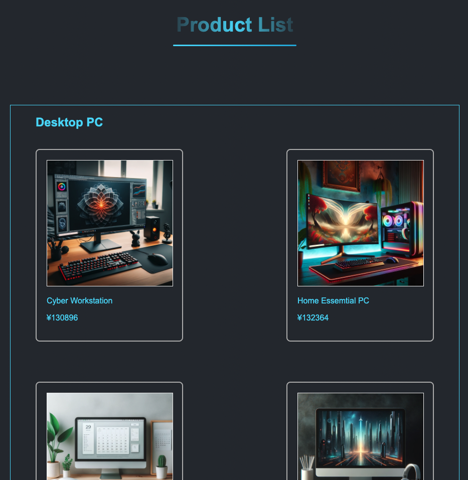

# EC-site-Product-List-RecursionCS

ReacursionCSのReactコースの課題

# 概要

Reactのコンポーネントの扱いに慣れるための課題です



# Access

[アクセス！](https://kip2.github.io/EC-site-Product-List-RecursionCS)

# 作成にあたって

## 参考書籍

以下の書籍を参考にしました

[Reactハンズオンラーニング](https://www.oreilly.co.jp//books/9784873119380/)

## サンプル画像について

chatGPTのDALL-E3で作成しています

## サンプル文章について

chatGPTに協力してもらいました

---

# 追記

以下、必要かわかりませんが、同じ目的で勉強している人用に、謎のファイルについて説明

# devtoolについて

ランダムな数字を作成するスクリプト

ランダムな値段生成に使った

# setup.shについて

reactをローカル環境で揃える際に必要なものをシェルスクリプト化

以下のリポジトリに詳しくまとまっています

https://github.com/kip2/ShellScripts/tree/main/React-StartUp

念のため使用法を書いておきます

1. 以下コマンドで起動

```shell
. setup.sh
```

2. プロジェクト名の入力を求められるので、入力する

3. プロジェクト名でディレクトリが作成され、react構築に必要なものがインストールされる

4. 最後に、ビルドされ、自動でブラウザが立ち上がります

## 使用上の注意

エラー処理を全くしていないので、インストール中に失敗した場合は、作成されたディレクトリごと削除して、一からプロジェクトを作成し直してください


